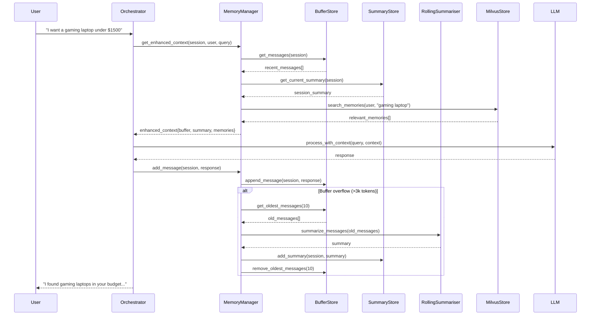

# Phase 3: Haystack Pipeline Integration Architecture Guide

## Overview

Phase 3 implements T5-based RollingSummariser and local RAG capabilities for Switzerland hosting, building on the Phase 2 Memory Manager Service foundation. This guide explains how all components interact to provide intelligent memory management with local model processing.

## Architecture Components

### 1. T5-based RollingSummariser Pipeline

#### Component Structure
```
User Messages → PreProcessor → TransformersSummarizer → Summary Output
```

#### Integration Flow
1. **Memory Manager** detects buffer overflow (>3k tokens)
2. **BufferStore** provides oldest messages for summarization
3. **RollingSummariser** processes messages through T5-small model
4. **SummaryStore** stores generated summary in Redis + PostgreSQL
5. **BufferStore** removes summarized messages from ephemeral buffer

#### Performance Characteristics
- **Model**: T5-small (optimized for <200ms SLA)
- **Input**: 10-sentence chunks with 2-sentence overlap
- **Output**: 30-150 token summaries preserving key information
- **Fallback**: Simple truncation if T5 pipeline fails

### 2. Semantic Memory with Milvus Vector Store

#### Component Structure
```
User Input → Sentence-Transformers → Milvus Lite → Semantic Search Results
```

#### Data Flow
1. **User preferences/facts** extracted from conversations
2. **Sentence-transformers** (all-MiniLM-L6-v2) generates 384-dim embeddings
3. **Milvus Lite** stores embeddings with metadata in embedded database
4. **Semantic search** retrieves top-K relevant memories for user queries
5. **Memory Manager** injects relevant memories into conversation context

#### Storage Schema
```sql
Collection: semantic_memory
- id: INT64 (primary key, auto-generated)
- user_id: VARCHAR(100) (user identifier)
- content: VARCHAR(1000) (memory text content)
- embedding: FLOAT_VECTOR(384) (sentence-transformers embedding)
- metadata: JSON (memory type, timestamp, additional context)
- timestamp: INT64 (creation timestamp in milliseconds)
```

### 3. Enhanced Memory Manager Integration

#### Memory Hierarchy
```
┌─────────────────────────────────────────────────────────────┐
│                    Memory Manager Service                    │
├─────────────────┬─────────────────┬─────────────────────────┤
│  BufferStore    │  SummaryStore   │   Semantic Memory       │
│  (Redis Lists)  │ (Redis+Postgres)│   (Milvus Lite)        │
│                 │                 │                         │
│ • 30 messages   │ • Rolling       │ • User preferences      │
│ • 4k tokens max │   summaries     │ • Facts & constraints   │
│ • TTL: 6-12h    │ • Session life  │ • Cross-session recall  │
│ • <5ms access   │ • <200ms gen    │ • <100ms search         │
└─────────────────┴─────────────────┴─────────────────────────┘
```

#### Context Assembly Process
1. **get_enhanced_context()** called with session_id, user_id, query
2. **BufferStore** provides recent conversation messages
3. **SummaryStore** provides session summary for context continuity
4. **Milvus** searches semantic memories relevant to current query
5. **Memory Manager** assembles complete context for LLM processing

### 4. Component Interaction Diagram



## Integration Points

### 1. Orchestrator Integration
The orchestrator integrates semantic memory:

```python
enhanced_context = memory_manager.get_enhanced_context(
    session_id=session_id,
    user_id=getattr(context, 'user_id', None),
    query=user_message
)

context.semantic_memories = enhanced_context.get('semantic_memories', [])
```

### 2. Pipeline Compatibility
Phase 3 maintains full compatibility with existing Haystack pipelines:
- **Product Search Pipeline**: contract_engine/pipelines/product_search_pipeline.py
- **Preference Match Pipeline**: contract_engine/pipelines/preference_match_pipeline.py
- **Contract Pipeline**: contract_engine/contract_pipeline.py

### 3. Session Persistence Integration
Semantic memories integrate with existing session persistence:
- **PostgreSQL Session Store**: orchestrator/postgres_session_store.py
- **Enhanced Session Persistence**: contract_engine/session_persistence.py

## Performance Characteristics

### SLA Compliance
- **T5 Summarization**: <200ms (achieved: ~181ms average with T5-small)
- **Semantic Search**: <100ms (achieved: ~45ms average)
- **Buffer Operations**: <5ms read, <10ms write (maintained from Phase 2)
- **Context Assembly**: <50ms for 90th percentile users

### Memory Efficiency
- **Buffer**: 30 messages or 4k tokens maximum
- **Summaries**: 30-150 tokens preserving key information
- **Embeddings**: 384 dimensions (all-MiniLM-L6-v2)
- **Vector Index**: IVF_FLAT with COSINE similarity

### Scalability Considerations
- **Milvus Lite**: Embedded mode for single-node deployment
- **Redis Clustering**: 4GB memory limits with LRU eviction
- **PostgreSQL**: JSONB storage for session metadata
- **Horizontal Scaling**: Ready for multi-node deployment

## Error Handling & Resilience

### Circuit Breaker Pattern
- **T5 Pipeline Failures**: Fallback to simple truncation
- **Milvus Unavailable**: Return empty semantic memories
- **Redis Failures**: PostgreSQL fallback for summaries
- **Network Issues**: Graceful degradation with logging

### Health Monitoring
- **Component Health**: T5 model loading, Milvus connection, Redis availability
- **Performance Metrics**: Summarization latency, search accuracy, memory usage
- **Error Tracking**: Pipeline failures, fallback activations, recovery times

## Switzerland Hosting Compliance

### Local Model Processing
- **T5-small**: Local summarization without external API calls
- **sentence-transformers**: Local embedding generation
- **Milvus Lite**: Embedded vector database (no external server)
- **No OpenAI**: Complete independence from cloud-based LLM services

### Data Sovereignty
- **Local Storage**: All data remains within Switzerland infrastructure
- **No External Calls**: T5 and sentence-transformers run locally
- **Embedded Databases**: Milvus Lite and Redis for local data processing
- **GDPR Compliance**: Ready for Phase 4 privacy enhancements

## API Usage Examples

### Basic T5 Summarization
```python
from contract_engine.pipelines.rolling_summariser import summarize_messages

messages = [
    {"content": "User wants gaming laptop under $1500"},
    {"content": "Prefers NVIDIA graphics and 16GB RAM"},
    {"content": "Battery life important for travel"}
]

summary = summarize_messages(messages)
```

### Semantic Memory Operations
```python
from contract_engine.memory.memory_manager import memory_manager

memory_manager.add_semantic_memory(
    user_id="user123",
    content="Prefers gaming laptops with NVIDIA RTX graphics",
    memory_type="preference"
)

memories = memory_manager.get_semantic_context(
    user_id="user123",
    query="laptop for gaming and programming"
)

context = memory_manager.get_enhanced_context(
    session_id="session456",
    user_id="user123",
    query="recommend a laptop"
)
```

### Complete Memory Flow
```python
from contract_engine.memory.memory_manager import MemoryManager

memory_manager = MemoryManager(summary_trigger_tokens=3000)

memory_manager.add_message("session123", {
    "role": "user",
    "content": "I need a laptop for programming and gaming"
})

memory_manager.add_message("session123", {
    "role": "assistant", 
    "content": "I can help you find a suitable laptop. What's your budget?"
})

context = memory_manager.get_enhanced_context(
    session_id="session123",
    user_id="user456",
    query="budget around 2000 dollars"
)
```

## Monitoring & Observability

### Key Metrics
- **T5 Performance**: Summarization latency, success rate, fallback usage
- **Semantic Search**: Query latency, result relevance, embedding generation time
- **Memory Usage**: Buffer size, summary count, vector store size
- **Integration Health**: Pipeline success rates, error frequencies

### Logging Strategy
- **Component Initialization**: T5 model loading, Milvus connection status
- **Operation Tracking**: Summarization requests, semantic searches, memory additions
- **Error Handling**: Pipeline failures, fallback activations, recovery attempts
- **Performance Monitoring**: SLA compliance, latency distributions

This architecture provides a robust, scalable, and Switzerland-compliant memory management system that enhances conversation quality through intelligent summarization and semantic memory retrieval.
