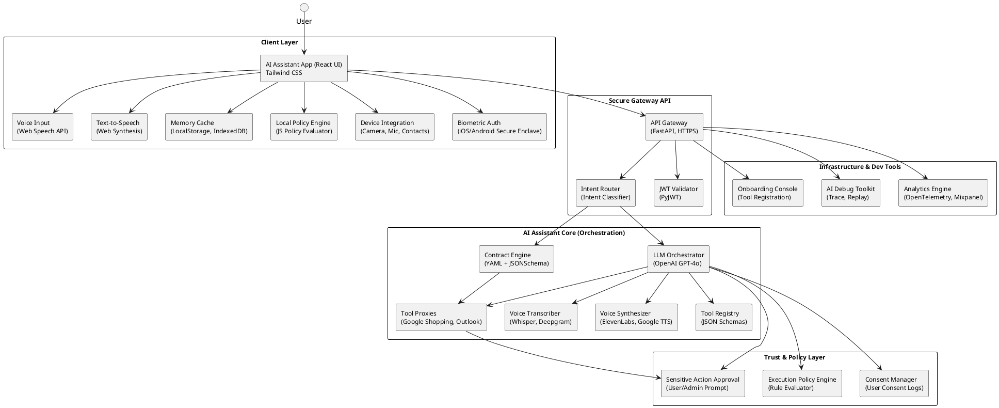
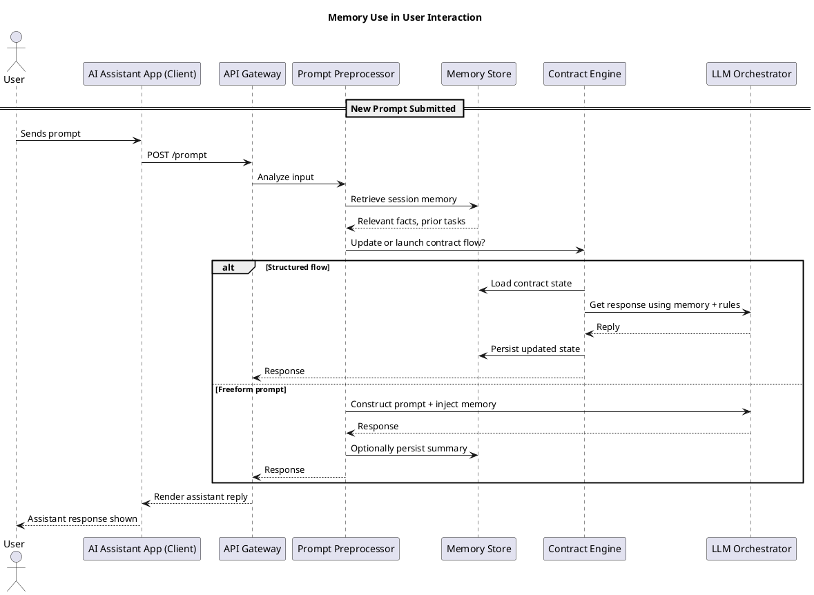

# Swisper Core Architecture Overview

## System Architecture

Swisper Core implements a clean separation between the **Finite State Machine (FSM)** as a control plane and **Haystack Pipelines** as a data plane, providing a robust and scalable AI assistant architecture.

### High-Level Architecture Diagram



### Memory Management Sequence



## Core Architecture Principles

### 1. Control Plane vs Data Plane Separation

**FSM (Control Plane)**:
- Manages conversation flow and user context
- Handles state transitions and approvals
- Orchestrates pipeline execution
- Maintains session persistence

**Haystack Pipelines (Data Plane)**:
- Stateless data processing components
- Product search and preference matching
- Content scraping and analysis
- Result ranking and filtering

### 2. Component Architecture

#### Core Components

**Contract Engine**
- FSM-based contract flow management
- Explicit state transitions with audit trail
- YAML-based contract definitions
- State persistence and recovery

**Gateway**
- FastAPI-based API gateway
- Session management and authentication
- Request routing and validation
- Security and rate limiting

**Haystack Pipeline**
- Modular data processing pipelines
- Component-based architecture
- Caching and performance optimization
- Error handling and fallback modes

**Orchestrator**
- Intent routing and classification
- Session orchestration
- Pipeline coordination
- Context management

**Tool Adapter**
- External service integrations
- Google Shopping API integration
- Checkout and payment processing
- Service health monitoring

### 3. Pipeline Architecture

#### Product Search Pipeline
```
SearchComponent → AttributeAnalyzer → ResultLimiter
```

**Flow**:
1. **SearchComponent**: Queries Google Shopping API with user constraints
2. **AttributeAnalyzer**: Extracts product attributes and price ranges using LLM analysis
3. **ResultLimiter**: Limits results (≤50 products) or requests constraint refinement

**Features**:
- Intelligent caching (60-minute TTL for attribute analysis)
- Performance monitoring and metrics collection
- Graceful degradation when external services fail

#### Preference Match Pipeline
```
SpecScraper → CompatibilityChecker → PreferenceRanker
```

**Flow**:
1. **SpecScraper**: Scrapes detailed product specifications from vendor websites
2. **CompatibilityChecker**: Validates hard constraints compatibility
3. **PreferenceRanker**: Ranks products by soft preferences using LLM scoring

**Features**:
- Batch processing for efficiency
- Hard constraint validation
- Soft preference scoring with confidence metrics

## Memory Architecture

### Four-Tier Memory System

**Ephemeral Buffer (Redis)**:
- Recent messages (≤30 messages or 4k tokens)
- Immediate reasoning context
- Session-scoped temporary data

**Short-Term Summary (Redis+Postgres)**:
- Rolling abstractive summaries
- Older chat history compression
- Contract state summaries

**Long-Term Semantic Memory (Vector DB)**:
- User facts and preferences
- Completed contracts history
- Personalization data

**Auditable Artifacts (S3)**:
- Complete raw chat logs
- FSM execution logs
- Contract JSON for compliance

### Session Management

**Enhanced Persistence**:
- Pipeline execution history
- Performance metrics tracking
- Context serialization with metadata

**Automatic Cleanup**:
- 24-hour session retention
- Expired data removal
- Performance optimization

## Security and Privacy

### Switzerland Data Sovereignty
- Local model processing (T5, sentence-transformers)
- No external data transmission for sensitive operations
- Compliance with Swiss privacy regulations

### PII Handling
- Automatic PII detection and extraction
- Secure storage and processing
- User consent management

### Trust Framework
- Consent manager for user permissions
- Policy engine for execution rules
- Sensitive action approval workflows

## Performance Characteristics

### Caching Strategy
- **Attribute Analysis**: 60-minute TTL
- **Pipeline Results**: 30-minute TTL
- **Session Data**: 24-hour retention

### Monitoring
- Comprehensive timing metrics
- Performance benchmarking
- Health monitoring for external services

### Scalability
- Async pipeline execution
- Component isolation for independent scaling
- Stateless pipeline design

## Error Handling and Resilience

### Graceful Degradation
- Fallback mechanisms when LLM services unavailable
- Alternative processing paths for web scraping failures
- User-friendly error messages

### Health Monitoring
- System health tracking for external services
- Automatic service discovery and failover
- Performance threshold monitoring

## Integration Points

### External Services
- **Google Shopping API**: Product search and pricing
- **OpenAI GPT-4o**: LLM processing and analysis
- **Milvus Vector Database**: Semantic memory storage
- **Web Scraping Services**: Product specification extraction

### Internal Components
- **FSM State Handlers**: Contract execution logic
- **Pipeline Components**: Data processing modules
- **Session Store**: Persistence layer
- **Memory Manager**: Multi-tier memory coordination

## Development and Testing

### Architecture Benefits

**Separation of Concerns**:
- Clear boundaries between control flow and data transformation
- Reusable pipeline components across different contracts
- Independent testing and deployment

**Testability & Maintainability**:
- Each pipeline component is a pure function
- State transitions are explicit and auditable
- Comprehensive test coverage with isolated unit tests

**Performance & Scalability**:
- Pipeline results cached to reduce redundant processing
- Performance monitoring for optimization insights
- Async execution for improved responsiveness

## Next Steps

For detailed implementation guidance, see:
- [Tools and Contract Management](tools-and-contracts.md)
- [Session and Context Management](session-management.md)
- [Memory Management](memory-management.md)
- [Deployment Strategy](../deployment/production-strategy.md)
