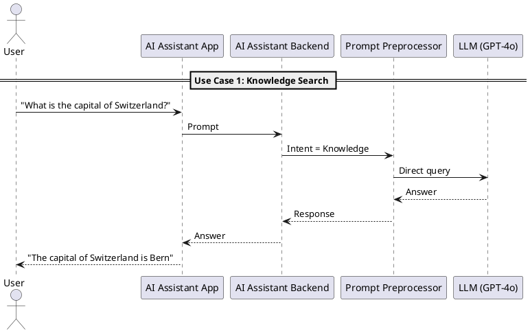
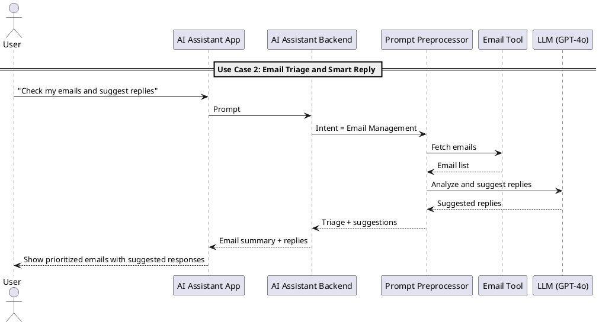
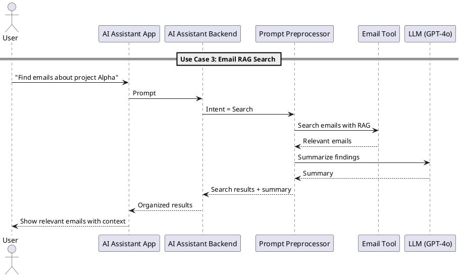
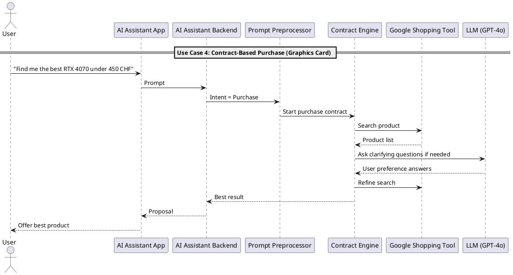
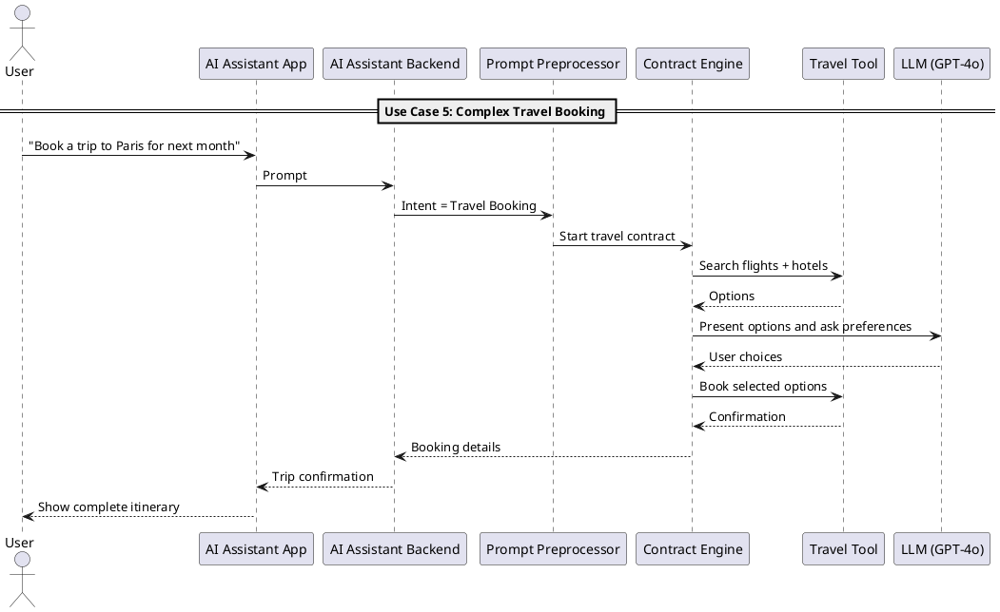

# Use Case Scenarios

This document contains detailed PlantUML diagrams for various Swisper Core use cases, demonstrating the system's capabilities across different interaction patterns.

## Use Case 1: Knowledge Search

## Use Case 2: Email Triage and Smart Reply

## Use Case 3: Email RAG Search

## Use Case 4: Contract-Based Purchase (Graphics Card)

## Use Case 5: Complex Travel Booking

## Architecture Benefits

These use cases demonstrate:

1. **Flexible Intent Routing**: Different user intents trigger appropriate processing paths
2. **Contract-Based Flows**: Complex multi-step processes managed by FSM contracts
3. **Tool Integration**: Seamless integration with external services and APIs
4. **Context Awareness**: Memory and session management across interactions
5. **User Experience**: Consistent interface across different interaction types

For implementation details, see:
- [Tools and Contract Management](tools-and-contracts.md)
- [Session Management](session-management.md)
- [Memory Management](memory-management.md)
