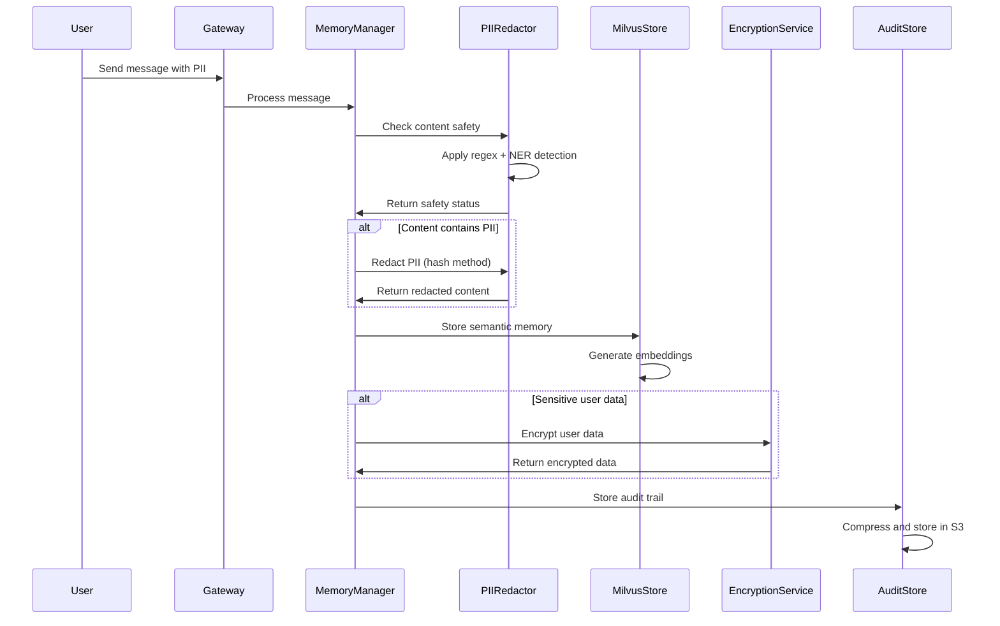

# Phase 4: Privacy & Governance Architecture Guide

## Overview

Phase 4 implements a comprehensive Privacy & Governance layer on top of the existing Memory Manager infrastructure from Phase 3. This architecture ensures business-critical PII protection while maintaining Switzerland hosting compliance through local processing.

## Architecture Components

### 1. Multi-Layered PII Detection & Redaction

```
┌─────────────────────────────────────────────────────────────┐
│                    PIIRedactor                              │
├─────────────────────────────────────────────────────────────┤
│  Layer 1: Regex Patterns (Structured PII)                  │
│  ├─ EMAIL: [A-Za-z0-9._%+-]+@[A-Za-z0-9.-]+\.[A-Z|a-z]{2,} │
│  ├─ SWISS_PHONE: (\+41|0041|0)\s?[1-9]\d{1,2}\s?\d{3}...   │
│  ├─ IBAN: CH\d{2}\s?\d{4}\s?\d{4}\s?\d{4}\s?\d{4}\s?\d{1}  │
│  ├─ CREDIT_CARD: (?:\d[ -]*?){13,16}                        │
│  └─ SWISS_SSN: 756\.\d{4}\.\d{4}\.\d{2}                    │
├─────────────────────────────────────────────────────────────┤
│  Layer 2: spaCy NER (Named Entities)                       │
│  ├─ PERSON: Individual names                                │
│  ├─ ORG: Organization names                                 │
│  ├─ GPE: Geopolitical entities                             │
│  └─ DATE: Date references                                   │
├─────────────────────────────────────────────────────────────┤
│  Layer 3: LLM Fallback (Optional - Disabled for CH)        │
│  └─ Complex/fuzzy PII detection (Switzerland: OFF)          │
└─────────────────────────────────────────────────────────────┘
```

### 2. Privacy-Enhanced Memory Architecture

```
┌───────────────────────────────────────────────────────────────┐
│                    Memory Manager                             │
│  ┌─────────────────┐  ┌─────────────────┐  ┌─────────────────┐ │
│  │  BufferStore    │  │  SummaryStore   │  │ MilvusSemanticStore│
│  │   (Redis)       │  │ (Redis→PG)      │  │   (Vector DB)   │ │
│  │                 │  │                 │  │                 │ │
│  │ ┌─────────────┐ │  │ ┌─────────────┐ │  │ ┌─────────────┐ │ │
│  │ │PII Detection│ │  │ │PII Redaction│ │  │ │Safety Check │ │ │
│  │ │   Layer     │ │  │   Layer     │ │  │ │   Layer     │ │ │
│  │ └─────────────┘ │  │ └─────────────┘ │  │ └─────────────┘ │ │
│  └─────────────────┘  └─────────────────┘  └─────────────────┘ │
└───────────────────────────────────────────────────────────────┘
                                │
                                ▼
┌───────────────────────────────────────────────────────────────┐
│                  Privacy Services Layer                       │
├─────────────────┬─────────────────┬─────────────────────────────┤
│ EncryptionService│   AuditStore    │      GDPR Endpoints       │
│                 │     (S3)        │                           │
│ ┌─────────────┐ │ ┌─────────────┐ │ ┌─────────────────────────┐ │
│ │Per-user Keys│ │ │Chat History │ │ │/api/privacy/memories/   │ │
│ │PBKDF2+Fernet│ │ │FSM Logs     │ │ │  - GET: List memories   │ │
│ │             │ │ │Contract JSON│ │ │  - DELETE: Right to forget│ │
│ └─────────────┘ │ └─────────────┘ │ └─────────────────────────┘ │
└─────────────────┴─────────────────┴─────────────────────────────┘
```

### 3. Data Flow with Privacy Protection



## Component Integration Points

### 1. T5 RollingSummariser Integration

```python
def summarize_messages(messages: List[Dict[str, Any]]) -> str:
    # Combine message content
    combined_content = " ".join(content_parts)
    
    # Apply PII redaction BEFORE T5 processing
    redacted_content = pii_redactor.redact(
        combined_content, 
        redaction_method="placeholder"
    )
    
    # Process with T5 on privacy-protected content
    pipeline = create_rolling_summariser_pipeline()
    result = pipeline.run(query=redacted_content)
    
    return extract_summary(result)
```

**Business Impact:**
- Session summaries are PII-free
- T5 processing on sanitized content
- Conversation context preserved

### 2. Milvus Semantic Memory Integration

```python
def add_memory(self, user_id: str, content: str, memory_type: str = "preference"):
    # Safety check before vector storage
    if not pii_redactor.is_text_safe_for_storage(content):
        logger.warning(f"PII detected, applying redaction for user {user_id}")
        content = pii_redactor.redact(content, redaction_method="hash")
        metadata["pii_detected"] = True
    
    # Generate embedding from protected content
    embedding = self.embedding_model.encode([content])[0].tolist()
    
    # Store with privacy metadata
    self.collection.insert([{
        "user_id": user_id,
        "content": content,
        "embedding": embedding,
        "metadata": json.dumps({
            "privacy_processed": True,
            **metadata
        })
    }])
```

**Business Impact:**
- User preferences stored safely
- Semantic search without PII exposure
- Long-term memory compliance

### 3. Session Persistence Integration

```python
class EnhancedSessionPersistence:
    def save_session_with_privacy(self, session_id: str, session_data: Dict[str, Any]):
        # Apply PII redaction to chat history
        if "chat_history" in session_data:
            protected_history = []
            for message in session_data["chat_history"]:
                if "content" in message:
                    message["content"] = pii_redactor.redact(
                        message["content"], 
                        redaction_method="hash"
                    )
                protected_history.append(message)
            session_data["chat_history"] = protected_history
        
        # Encrypt sensitive session metadata
        if "user_preferences" in session_data:
            encrypted_prefs = encryption_service.encrypt_user_data(
                session_data["user_id"], 
                session_data["user_preferences"]
            )
            session_data["encrypted_preferences"] = encrypted_prefs
            del session_data["user_preferences"]
        
        # Store audit trail
        audit_store.store_chat_artifact(
            session_id, 
            session_data["user_id"], 
            session_data["chat_history"]
        )
        
        # Save to PostgreSQL
        self.postgres_store.save_session(session_id, session_data)
```

## Privacy Processing Pipeline

### 1. Input Processing

```
User Input → PII Detection → Business Context Preservation → Storage Decision
     │              │                    │                        │
     │              ▼                    ▼                        ▼
     │         [EMAIL_abc123]      "order #12345"           Safe Storage
     │         [PERSON_def456]     "2000 CHF budget"        OR Redaction
     │         [PHONE_ghi789]      "laptop preferences"     Required
     └─────────────────────────────────────────────────────────────┘
```

### 2. Storage Layer Protection

```
┌─────────────────────────────────────────────────────────────┐
│                    Storage Decision Matrix                   │
├─────────────────┬─────────────────┬─────────────────────────┤
│   Content Type  │   PII Status    │      Action             │
├─────────────────┼─────────────────┼─────────────────────────┤
│ User Preferences│   PII-Free      │ Direct Vector Storage   │
│ Business Context│   PII-Free      │ Direct Vector Storage   │
│ Contact Info    │   PII Detected  │ Hash Redaction          │
│ Personal Names  │   PII Detected  │ Placeholder Redaction   │
│ Sensitive Data  │   High Risk     │ Encryption + Audit      │
└─────────────────┴─────────────────┴─────────────────────────┘
```

### 3. Retrieval and Access Control

```python
def get_user_context(user_id: str, query: str) -> Dict[str, Any]:
    # Retrieve semantic memories with privacy metadata
    memories = milvus_semantic_store.search_memories(user_id, query, top_k=3)
    
    # Decrypt sensitive data if needed
    decrypted_memories = []
    for memory in memories:
        if memory.get("encrypted", False):
            decrypted_content = encryption_service.decrypt_user_data(
                user_id, 
                memory["content"]
            )
            memory["content"] = decrypted_content
        decrypted_memories.append(memory)
    
    # Assemble context with privacy tracking
    return {
        "memories": decrypted_memories,
        "privacy_metadata": {
            "pii_redacted_count": sum(1 for m in memories if m.get("pii_detected")),
            "encrypted_count": sum(1 for m in memories if m.get("encrypted")),
            "total_memories": len(memories)
        }
    }
```

## GDPR Compliance Architecture

### 1. Data Access Rights (Article 15)

```python
@app.get("/api/privacy/memories/{user_id}")
async def list_user_memories(user_id: str):
    """Comprehensive data access for GDPR Article 15"""
    return {
        "user_id": user_id,
        "semantic_memories": milvus_semantic_store.get_user_memory_stats(user_id),
        "audit_artifacts": audit_store.get_user_artifacts(user_id),
        "encrypted_data_count": encryption_service.get_user_data_count(user_id),
        "data_retention_policy": "7_years",
        "processing_purposes": [
            "conversation_context",
            "preference_learning", 
            "contract_assistance"
        ]
    }
```

### 2. Right to Erasure (Article 17)

```python
@app.delete("/api/privacy/memories/{user_id}")
async def delete_user_memories(user_id: str, confirm_deletion: bool = False):
    """Complete data deletion for GDPR Article 17"""
    if not confirm_deletion:
        raise HTTPException(400, "Must confirm deletion")
    
    # Delete from all storage layers
    semantic_deleted = milvus_semantic_store.delete_user_memories(user_id)
    audit_deleted = audit_store.delete_user_artifacts(user_id)
    session_cleared = memory_manager.clear_session_memory(user_id)
    
    # Verify complete deletion
    verification = {
        "semantic_memories_deleted": semantic_deleted,
        "audit_artifacts_deleted": audit_deleted,
        "active_sessions_cleared": session_cleared,
        "deletion_timestamp": datetime.utcnow().isoformat()
    }
    
    return verification
```

### 3. Data Portability (Article 20)

```python
@app.get("/api/privacy/export/{user_id}")
async def export_user_data(user_id: str):
    """Data export for GDPR Article 20"""
    export_data = {
        "user_id": user_id,
        "export_timestamp": datetime.utcnow().isoformat(),
        "semantic_memories": milvus_semantic_store.export_user_memories(user_id),
        "conversation_history": audit_store.export_user_conversations(user_id),
        "preferences": encryption_service.export_user_preferences(user_id)
    }
    
    # Create downloadable archive
    archive_path = create_user_data_archive(export_data)
    return FileResponse(archive_path, filename=f"user_data_{user_id}.zip")
```

## Performance Characteristics

### 1. PII Detection Latency

```
┌─────────────────┬─────────────────┬─────────────────────────┐
│   Layer         │   Avg Latency   │      SLA Target         │
├─────────────────┼─────────────────┼─────────────────────────┤
│ Regex Patterns  │     <5ms        │        <10ms            │
│ spaCy NER       │    20-50ms      │        <100ms           │
│ Combined        │    25-55ms      │        <200ms           │
│ Safety Check    │     <5ms        │        <10ms            │
└─────────────────┴─────────────────┴─────────────────────────┘
```

### 2. Memory Storage Performance

```
┌─────────────────┬─────────────────┬─────────────────────────┐
│   Operation     │   Avg Latency   │      SLA Target         │
├─────────────────┼─────────────────┼─────────────────────────┤
│ PII Redaction   │    <100ms       │        <200ms           │
│ Encryption      │     <5ms        │        <10ms            │
│ Vector Storage  │    <50ms        │        <100ms           │
│ Audit Logging   │    <20ms        │        <50ms            │
└─────────────────┴─────────────────┴─────────────────────────┘
```

### 3. GDPR Endpoint Performance

```
┌─────────────────┬─────────────────┬─────────────────────────┐
│   Endpoint      │   Avg Latency   │      SLA Target         │
├─────────────────┼─────────────────┼─────────────────────────┤
│ List Memories   │    <500ms       │        <1000ms          │
│ Delete Memories │    <2000ms      │        <5000ms          │
│ Export Data     │    <10000ms     │        <30000ms         │
│ PII Check       │    <100ms       │        <200ms           │
└─────────────────┴─────────────────┴─────────────────────────┘
```

## Security Architecture

### 1. Encryption at Rest

```
┌─────────────────────────────────────────────────────────────┐
│                  Encryption Layers                          │
├─────────────────┬─────────────────┬─────────────────────────┤
│   Data Type     │   Encryption    │      Key Management     │
├─────────────────┼─────────────────┼─────────────────────────┤
│ User Preferences│ Fernet (AES256) │ Per-user derived keys   │
│ Session Data    │ pgcrypto        │ PostgreSQL managed      │
│ Audit Artifacts │ S3 SSE-AES256   │ AWS KMS managed         │
│ Vector Embeddings│ Application     │ Hash-based redaction    │
└─────────────────┴─────────────────┴─────────────────────────┘
```

### 2. Access Control Matrix

```
┌─────────────────┬─────────────────┬─────────────────────────┐
│   Component     │   Access Level  │      Permissions        │
├─────────────────┼─────────────────┼─────────────────────────┤
│ PIIRedactor     │ Application     │ Read/Process text       │
│ EncryptionService│ Application    │ Encrypt/Decrypt data    │
│ MilvusStore     │ User-scoped     │ Read/Write own memories │
│ AuditStore      │ Admin/User      │ Read own, Admin all     │
│ GDPR Endpoints  │ User-verified   │ Own data only           │
└─────────────────┴─────────────────┴─────────────────────────┘
```

## Monitoring and Observability

### 1. Privacy Metrics

```python
class PrivacyMetrics:
    def track_pii_detection(self, user_id: str, entities_detected: int):
        self.metrics.increment("pii.detection.count", tags={
            "user_id": user_id,
            "entity_count": entities_detected
        })
    
    def track_encryption_operation(self, operation: str, success: bool):
        self.metrics.increment("encryption.operation", tags={
            "operation": operation,
            "success": success
        })
    
    def track_gdpr_request(self, request_type: str, user_id: str):
        self.metrics.increment("gdpr.request", tags={
            "type": request_type,
            "user_id": user_id
        })
```

### 2. Audit Trail Structure

```json
{
  "audit_event": {
    "timestamp": "2024-06-04T14:30:00Z",
    "event_type": "pii_redaction",
    "user_id": "user_123",
    "session_id": "session_456",
    "details": {
      "entities_detected": ["EMAIL", "PHONE"],
      "redaction_method": "hash",
      "processing_time_ms": 45
    },
    "compliance": {
      "gdpr_article": "Article_6_1_f",
      "lawful_basis": "legitimate_interest",
      "retention_period": "7_years"
    }
  }
}
```

## Switzerland Hosting Compliance

### 1. Local Processing Requirements

```
┌─────────────────────────────────────────────────────────────┐
│              Switzerland Hosting Checklist                  │
├─────────────────┬─────────────────┬─────────────────────────┤
│   Component     │   Requirement   │      Implementation     │
├─────────────────┼─────────────────┼─────────────────────────┤
│ PII Detection   │ Local Only      │ spaCy NER (local model) │
│ Text Processing │ No External APIs│ T5-small (local model)  │
│ Vector Storage  │ EU Region       │ Milvus Lite (embedded)  │
│ Audit Storage   │ EU Region       │ S3 eu-central-1        │
│ Encryption      │ Local Keys      │ Client-side Fernet      │
└─────────────────┴─────────────────┴─────────────────────────┘
```

### 2. Data Sovereignty

```python
# Configuration for Switzerland hosting compliance
SWITZERLAND_HOSTING_CONFIG = {
    "pii_detection": {
        "use_ner": True,           # Local spaCy processing
        "use_llm_fallback": False, # No external API calls
        "model": "en_core_web_lg"  # Downloaded locally
    },
    "storage": {
        "aws_region": "eu-central-1",  # EU region
        "encryption": "client_side",    # Local encryption
        "data_residency": "EU"          # Data stays in EU
    },
    "processing": {
        "t5_model": "local",           # Local T5 inference
        "embedding_model": "local",    # Local sentence-transformers
        "external_apis": "disabled"    # No external dependencies
    }
}
```

This architecture ensures comprehensive privacy protection while maintaining high performance and Switzerland hosting compliance for business-critical applications.
